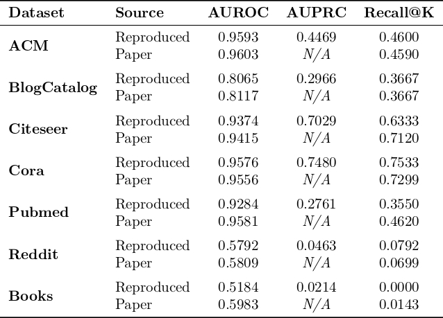

# 浙江大学软件学院夏令营 - 数据治理与数据挖掘营 - 图异常检测方法复现与实验分析

## 1. 项目概述

本项目是浙江大学软件学院夏令营，数据治理与数据挖掘分营的图异常检测项目。

本项目旨在完成**方向二：方法复现与实验分析** 。笔者精选了近年在图异常检测（Graph Anomaly Detection，GAD）领域的多个代表性模型，并进行了复现和分析工作 。

## 2. 复现文章列表

本仓库复现了以下三篇文章：

- **[Training-free Graph Anomaly Detection: A Simple Approach via Singular Value Decomposition (WWW 2025)](https://openreview.net/forum?id=OG1qScEqHK#discussion)**

    TFGAD，一个简洁高效的图异常检测算法，它通过对属性矩阵和邻接矩阵进行低秩逼近，结合属性重构误差和结构投影长度来计算节点的异常分数。

- **[Boosting Graph Anomaly Detection with Adaptive Message Passing (ICLR 2024)](https://openreview.net/forum?id=CanomFZssu)**

     GADAM，一种通过自适应消息传递来增强图异常检测的模型。它包含一个局部模型（LIM）和一个全局模型（GIM），分别用于捕捉节点自身属性和邻居结构的一致性，以及全局的异常模式。

- **[UniGAD: Unifying Multi-level Graph Anomaly Detection (NIPS 2024)](https://arxiv.org/abs/2411.06427)**

    UniGAD，一个统一的多级图异常检测框架，旨在同时处理节点、边和图层面的异常。该框架引入了创新的图拼接网络（GraphStitch Network）和多尺度读出-查询采样器（MRQSampler）。

## 3. 实验数据集

按照项目要求，应在10个基准数据集上（Reddit, Weibo, Amazon,  YelpChi, Tolokers, Questions, T-Finance, Elliptic, DGraph-Fin, T-Social）对上述模型进行评估 。

**但，因选取复现的文章仅在这10个基准数据集中的部分数据集上评估，故笔者选取复现的文章评估的数据集是上进行复现评估，包括：**

- **引用网络**: Cora, Citeseer, Pubmed, ACM
- **社交网络**: BlogCatalog, Reddit, Weibo, T-Social, Yelp
- **电商与金融**: Amazon, Books, T-Finance, DGraph-Fin, Elliptic
- **问答与众包**: Questions, Tolokers

## 4. 环境配置

以下是本项目所使用的完整软硬件环境信息。

### 4.1 硬件环境

| 类型 | 配置说明                                          |
| ---- | ------------------------------------------------- |
| GPU  | NVIDIA RTX 3090 (24GB) × 1                        |
| CPU  | 15 vCPU Intel(R) Xeon(R) Platinum 8358P @ 2.60GHz |
| 内存 | 90 GB RAM                                         |

### 4.2 软件环境

| 项目       | 版本/说明         |
| ---------- | ----------------- |
| 操作系统   | Ubuntu 22.04 LTS  |
| CUDA       | 12.8              |
| 包管理工具 | Conda             |
| 环境文件   | `environment.yml` |

> 通过每篇文章复现文件夹中`environment.yml` 快速创建完全一致的运行环境。
> ```bash
> conda env create -f environment.yml
> ```

## 5. 如何运行

### 5.1 TF-GAD

```Bash
# 保证在对应的conda环境中 需准备好数据集，并在脚本中配置恰当的config
cd TF-GAD

# 运行复现 ZJU Summer Camp 要求的数据集实验
python tfgad_zju.py

# 运行复现原始论文中的数据集实验
python tfgad_paper.py
```

实验结果会保存在同目录下的 `results_zju.csv` 或 `results_paper.csv` 文件中。

### 5.2 GADAM

```Bash
# 保证在对应的conda环境中 需准备好数据集
cd GADAM

# 运行完整的 GADAM 模型 (适用于大数据集)
python run.py --data Cora --gpu 0 --local-epochs 100 --global-epochs 50 --local-lr 1e-3 --global-lr 5e-4

# 运行 Mini-batch 版本的 GADAM (适用于超大数据集)
python run_mini.py --data products --gpu 0 --local-epochs 1 --global-epochs 20
```

### 5.3 UniGAD

```Bash
# 保证在对应的conda环境中 需准备好数据集
cd UniGAD/src

# 运行一个完整的 UniGAD 实验流程 (以 weibo 数据集为例)
# 这将包括预训练和微调两个步骤
python main.py --datasets 1 --pretrain_model graphmae --kernels bwgnn,gcn --lr 5e-4 --save_model --epoch_pretrain 50 --batch_size 1 --khop 1 --epoch_ft 300 --lr_ft 0.003 --final_mlp_layers 3 --cross_modes ne2ne,n2ne,e2ne --metric AUROC --trials 5
```

## 6. 实验结果摘要

成功复现了各个模型在多个数据集上的性能，并将结果保存在了相应的`.csv`文件中。

- **TF-GAD 结果**: 存储在 `TF-GAD/` 目录下的 `results_zju.csv` 和 `results_paper.csv` 中。（下图为部分结果）


- **GADAM 结果**: 存储在 `GADAM/results/` 目录下，每个数据集一个文件，并提供了一个合并脚本 `merge.py`。



- **UniGAD 结果**: 运行 `main.py` 后，结果会保存在 `UniGAD/results/` 目录下，以数据集命名，并提供了一个合并脚本 `merge.py`。


## 7. 引用与参考

本项目的实现和分析过程，得益于以下优秀的开源工作：

- **UniGAD**: [https://github.com/YingtongLai/UniGAD](https://www.google.com/search?q=https://github.com/YingtongLai/UniGAD)
- **GraphMAE**: https://github.com/THUDM/GraphMAE
- **GADBench**: https://github.com/squareRoot3/GADBench/
- **GADAM**:https://github.com/PasaLab/GADAM
- 以及 **GLocalKD, iGAD, GmapAD, RQGNN, GraphPrompt** 等论文的开源代码，详细列表见 `UniGAD/README.MD`。